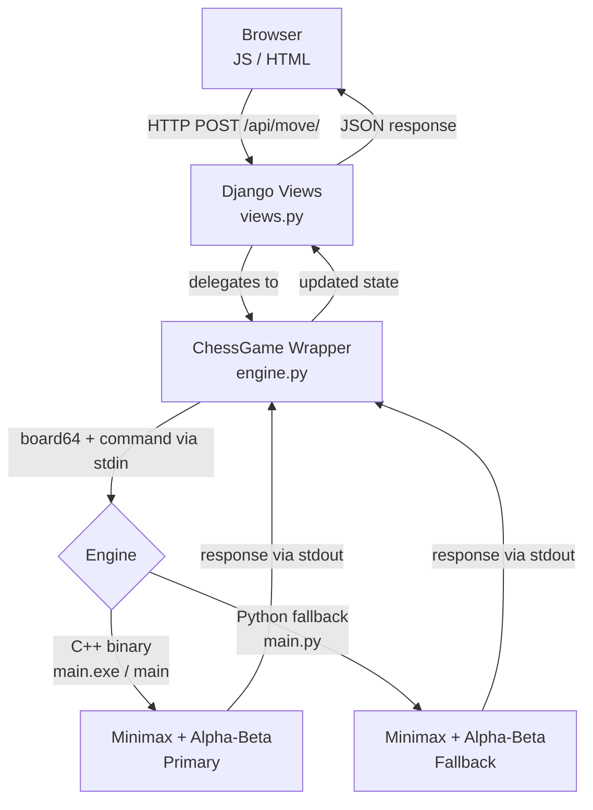

<div align="center">

# Checkora

**An open-source chess platform with an AI opponent powered by minimax search with alpha-beta pruning.**

Built on Django with a high-performance C++ engine and a Python fallback for maximum compatibility.

[](https://www.python.org/)
[](https://www.djangoproject.com/)
[](https://isocpp.org/)
[](LICENSE)
[](#tests)
[](https://github.com/Checkora/Checkora/issues)
[](CONTRIBUTING.md)
[](https://discord.gg/DvW3xVXw8g)

Join our Discord community for updates, support, and games: https://discord.gg/DvW3xVXw8g

### Core Maintainers

<table>
       <tr>
              <td align="center" style="padding: 6px 18px;">
                     <a href="https://github.com/EDWARD-012">
                            
                     </a>
                     <br />
                     <a href="https://github.com/EDWARD-012"><strong>@EDWARD-012</strong></a>
                     <br />
                     <a href="https://github.com/EDWARD-012">
                            
                     </a>
              </td>
              <td align="center" style="padding: 6px 18px;">
                     <a href="https://github.com/triemerge">
                            
                     </a>
                     <br />
                     <a href="https://github.com/triemerge"><strong>@triemerge</strong></a>
                     <br />
                     <a href="https://github.com/triemerge">
                            
                     </a>
              </td>
       </tr>
</table>

<sub>Click a profile or follow badge for release drops, roadmap notes, and engine updates.</sub>

</div>

---

## Contributors

<!-- CONTRIBUTORS_START -->
<a href="https://github.com/0rbiT-ai"></a><a href="https://github.com/2005rishabh"></a><a href="https://github.com/ANISHA-RAWAT"></a><a href="https://github.com/CodeMaster11000"></a><a href="https://github.com/EDWARD-012"></a><a href="https://github.com/EnKruptos"></a><a href="https://github.com/FTS18"></a><a href="https://github.com/MahalaxmiKannan"></a><a href="https://github.com/Mouni-Sanaboyina"></a><a href="https://github.com/NayansiDupare"></a><a href="https://github.com/PRODHOSH"></a><a href="https://github.com/Pooja-V4"></a><a href="https://github.com/Pranav-0440"></a><a href="https://github.com/Pranava116"></a><a href="https://github.com/Rajal-ui"></a><a href="https://github.com/RuchiSheoran"></a><a href="https://github.com/SaptadeepMondal"></a><a href="https://github.com/Sara-Thakur"></a><a href="https://github.com/SecureAditi"></a><a href="https://github.com/Shrishagk"></a><a href="https://github.com/SiRa111"></a><a href="https://github.com/Siddharth-sde"></a><a href="https://github.com/Soumipal56"></a><a href="https://github.com/SrashtiChauhan"></a><a href="https://github.com/Steel-roger-moondradev"></a><a href="https://github.com/VITianYash42"></a><a href="https://github.com/Vaishnav-Hub9"></a><a href="https://github.com/aayushbamal"></a><a href="https://github.com/akash3911"></a><a href="https://github.com/akashgoudsidduluri"></a><a href="https://github.com/akhilmodi29"></a><a href="https://github.com/amarpratapsingh2452"></a><a href="https://github.com/aniketchauhan16"></a><a href="https://github.com/anshiikaa001"></a><a href="https://github.com/anwitamishra"></a><a href="https://github.com/artiverma-00"></a><a href="https://github.com/ash1shkumar"></a><a href="https://github.com/asnaassalam"></a><a href="https://github.com/bh462007"></a><a href="https://github.com/biharkhushisingh-lab"></a><a href="https://github.com/chekr-max"></a><a href="https://github.com/deepsikha-dash"></a><a href="https://github.com/diptipradeep"></a><a href="https://github.com/divya-d510"></a><a href="https://github.com/gowthamrdyy"></a><a href="https://github.com/harshitkr13"></a><a href="https://github.com/itsdakshjain"></a><a href="https://github.com/itsmeesnehaa"></a><a href="https://github.com/jancysen"></a><a href="https://github.com/kartik12421"></a><a href="https://github.com/krishkhinchi"></a><a href="https://github.com/kush-mehra1"></a><a href="https://github.com/manurajgoel"></a><a href="https://github.com/maria-453"></a><a href="https://github.com/mittalsonal"></a><a href="https://github.com/nipundeept"></a><a href="https://github.com/nishtha-agarwal-211"></a><a href="https://github.com/nitish06nkc"></a><a href="https://github.com/niy-ati"></a><a href="https://github.com/parthc6416"></a><a href="https://github.com/parthpatidar03"></a><a href="https://github.com/radhikaa188"></a><a href="https://github.com/rajat552"></a><a href="https://github.com/renganathc"></a><a href="https://github.com/richachauhan15"></a><a href="https://github.com/rmagdaleena2508-01"></a><a href="https://github.com/roneet0916"></a><a href="https://github.com/saswatdutta1310"></a><a href="https://github.com/shreyamahesh07-git"></a><a href="https://github.com/shrutip04"></a><a href="https://github.com/shrutisharma-sh"></a><a href="https://github.com/shubhamjrd4559-sudo"></a><a href="https://github.com/sreevyarao"></a><a href="https://github.com/sricharan-213"></a><a href="https://github.com/ssuyashhhh"></a><a href="https://github.com/sujithputta02"></a><a href="https://github.com/tharunika-19"></a><a href="https://github.com/the404packet"></a><a href="https://github.com/triemerge"></a><a href="https://github.com/unnati-jaiswal24"></a><a href="https://github.com/vishwassinfinity"></a><a href="https://github.com/zenowinged"></a><a href="https://github.com/zqleslie"></a>
<!-- CONTRIBUTORS_END -->

## Features

| Feature              | Description                                                                                         |
| -------------------- | --------------------------------------------------------------------------------------------------- |
| AI Opponent          | Minimax search with alpha-beta pruning for challenging gameplay                                     |
| Hybrid Engine        | C++ binary for maximum speed with an automatic Python fallback                                      |
| Full Move Validation | Legal moves enforced for all pieces including castling and promotion (en passant pending — see #88) |
| Game Timer           | Per-player countdown clocks with pause support                                                      |
| Material Score Panel | Live material advantage tracking that updates dynamically during gameplay                           |
| REST API             | Clean JSON endpoints powering a decoupled frontend                                                  |
| PvP & PvE Modes      | Play against a friend or challenge the AI                                                           |

---

## Quick Start

```bash
# 1. Clone the repository
git clone https://github.com/Checkora/Checkora.git
cd Checkora

# 2. Set up a virtual environment
python -m venv venv
venv\Scripts\activate        # Windows
source venv/bin/activate     # macOS / Linux

Note: Django 6.0 requires Python 3.12 or higher. If you have multiple versions on Windows, use a compatible installed version, for example: py -3.12 -m venv venv

# 3. Install dependencies
pip install -r requirements.txt

# 4. Set up environment variables
# Copy example env file
# Windows (PowerShell)
copy .env.example .env

# macOS / Linux
cp .env.example .env

# Open `.env` and set SECRET_KEY if needed

# 5. Run migrations and start the server
python manage.py migrate
python manage.py runserver
```

Open `http://127.0.0.1:8000/` in your browser and start playing.

### Compile the C++ Engine _(optional but recommended)_

The compiled binary is not committed to the repository. Each contributor compiles for their own platform. If the binary is absent, Checkora automatically falls back to the Python engine.

```bash
# Windows
g++ -O2 game/engine/main.cpp -o game/engine/main.exe

# macOS / Linux
g++ -O2 game/engine/main.cpp -o game/engine/main
```

---

## Architecture

Checkora uses a clean three-layer architecture:

```
Browser (JS/HTML/CSS)
       |
       v
Django Views (views.py)          <- HTTP request handling & session state
       |
       v
ChessGame Wrapper (engine.py)    <- Translates board state into engine commands
       |
       |---> C++ Binary (main.exe / main)   <- Primary: fast minimax AI
       +---> Python Script (main.py)        <- Fallback: identical logic in Python
```

| Layer             | Technology            | Path                              |
| ----------------- | --------------------- | --------------------------------- |
| Frontend          | HTML, CSS, JavaScript | `game/templates/game/board.html`  |
| Backend           | Django 6.x            | `game/views.py`, `game/engine.py` |
| Engine (Primary)  | C++17                 | `game/engine/main.cpp`            |
| Engine (Fallback) | Python 3.12+          | `game/engine/main.py`             |

> For a full deep-dive into the backend components, execution flow, and AI internals, see the [Architecture Guide](structure.md).

### How It Works

When a player makes a move, the request flows through three layers:

1. **Browser** sends a `POST` request with the move coordinates
2. **Django** (`views.py`) receives it and delegates to the `ChessGame` wrapper in `engine.py`
3. **`engine.py`** serializes the board into a flat 64-character string and spawns the engine as a subprocess, sending commands via `stdin` and reading responses from `stdout`

The engine speaks a simple text-based protocol:

| Command    | Example                                          | Response                                    |
| ---------- | ------------------------------------------------ | ------------------------------------------- |
| `VALIDATE` | `VALIDATE <board64> <rights> <turn> fr fc tr tc` | `VALID` / `INVALID <reason>`                |
| `MOVES`    | `MOVES <board64> <rights> <turn> row col`        | `MOVES tr tc is_capture is_promotion ...`   |
| `BESTMOVE` | `BESTMOVE <board64> <rights> <turn> <depth>`     | `BESTMOVE fr fc tr tc`                      |
| `STATUS`   | `STATUS <board64> <rights> <turn>`               | `STATUS CHECK / CHECKMATE / STALEMATE / OK` |



---

## API Reference

| Method | Endpoint                | Description                             |
| ------ | ----------------------- | --------------------------------------- |
| `GET`  | `/`                     | Render the board UI                     |
| `POST` | `/api/move/`            | Execute a player move                   |
| `GET`  | `/api/valid-moves/`     | Get legal moves for a piece             |
| `POST` | `/api/new-game/`        | Start a new game (PvP or PvE)           |
| `GET`  | `/api/check-promotion/` | Check if a move triggers pawn promotion |
| `GET`  | `/api/state/`           | Retrieve the full current game state    |
| `POST` | `/api/pause/`           | Pause or resume the game clock          |
| `POST` | `/api/ai-move/`         | Request and execute an AI move          |

---

## Tests

The test suite runs fully in-memory — no compiled engine binary required.

```bash
python manage.py test game
```

28 tests covering all API endpoints, move validation, engine path resolution, promotion logic, and AI mode enforcement.

---

## Contributing

Contributions are welcome! Please read [CONTRIBUTING.md](CONTRIBUTING.md) for branch naming conventions, commit message format, and PR guidelines before submitting.

---

## License

Released under the [MIT License](LICENSE).
