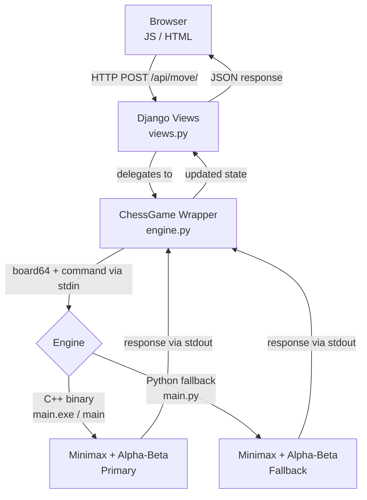

<div align="center">

# Checkora

**An open-source chess platform with an AI opponent powered by minimax search with alpha-beta pruning.**

Built on Django with a high-performance C++ engine and a Python fallback for maximum compatibility.

[](https://www.python.org/)
[](https://www.djangoproject.com/)
[](https://isocpp.org/)
[](LICENSE)
[](#tests)
[](https://github.com/Checkora/Checkora/issues)
[](CONTRIBUTING.md)
[](https://discord.gg/DvW3xVXw8g)

Join our Discord community for updates, support, and games: https://discord.gg/DvW3xVXw8g

### Core Maintainers

<table>
       <tr>
              <td align="center" style="padding: 6px 18px;">
                     <a href="https://github.com/EDWARD-012">
                            
                     </a>
                     <br />
                     <a href="https://github.com/EDWARD-012"><strong>@EDWARD-012</strong></a>
                     <br />
                     <a href="https://github.com/EDWARD-012">
                            
                     </a>
              </td>
              <td align="center" style="padding: 6px 18px;">
                     <a href="https://github.com/triemerge">
                            
                     </a>
                     <br />
                     <a href="https://github.com/triemerge"><strong>@triemerge</strong></a>
                     <br />
                     <a href="https://github.com/triemerge">
                            
                     </a>
              </td>
       </tr>
</table>

<sub>Click a profile or follow badge for release drops, roadmap notes, and engine updates.</sub>

</div>

---

## Contributors

<!-- CONTRIBUTORS_START -->
<a href="https://github.com/0rbiT-ai"></a><a href="https://github.com/2005rishabh"></a><a href="https://github.com/ANISHA-RAWAT"></a><a href="https://github.com/CodeMaster11000"></a><a href="https://github.com/EDWARD-012"></a><a href="https://github.com/EnKruptos"></a><a href="https://github.com/FTS18"></a><a href="https://github.com/HarshMrigank"></a><a href="https://github.com/KrishKyada"></a><a href="https://github.com/MahalaxmiKannan"></a><a href="https://github.com/Mouni-Sanaboyina"></a><a href="https://github.com/NayansiDupare"></a><a href="https://github.com/Pooja-V4"></a><a href="https://github.com/Pranav-0440"></a><a href="https://github.com/Pranava116"></a><a href="https://github.com/Rajal-ui"></a><a href="https://github.com/RuchiSheoran"></a><a href="https://github.com/RuhanikaChotwani"></a><a href="https://github.com/Sakina-786-vi"></a><a href="https://github.com/SaptadeepMondal"></a><a href="https://github.com/Sara-Thakur"></a><a href="https://github.com/SecureAditi"></a><a href="https://github.com/Shashank-8p"></a><a href="https://github.com/Shrishagk"></a><a href="https://github.com/SiRa111"></a><a href="https://github.com/Siddharth-sde"></a><a href="https://github.com/SilverMenace"></a><a href="https://github.com/Soumipal56"></a><a href="https://github.com/SrashtiChauhan"></a><a href="https://github.com/Sreekuttan-007"></a><a href="https://github.com/Steel-roger-moondradev"></a><a href="https://github.com/VITianYash42"></a><a href="https://github.com/Vaishnav-Hub9"></a><a href="https://github.com/YASHcode-IIITV"></a><a href="https://github.com/YashKrTripathi"></a><a href="https://github.com/aayushbamal"></a><a href="https://github.com/akash3911"></a><a href="https://github.com/akashgoudsidduluri"></a><a href="https://github.com/akhilmodi29"></a><a href="https://github.com/amarpratapsingh2452"></a><a href="https://github.com/aniketchauhan16"></a><a href="https://github.com/anshiikaa001"></a><a href="https://github.com/anwitamishra"></a><a href="https://github.com/artiverma-00"></a><a href="https://github.com/ash1shkumar"></a><a href="https://github.com/asnaassalam"></a><a href="https://github.com/bh462007"></a><a href="https://github.com/chekr-max"></a><a href="https://github.com/deepsikha-dash"></a><a href="https://github.com/diptipradeep"></a><a href="https://github.com/divya-d510"></a><a href="https://github.com/enoshdev"></a><a href="https://github.com/gowthamrdyy"></a><a href="https://github.com/harshitkr13"></a><a href="https://github.com/itsdakshjain"></a><a href="https://github.com/itsmeesnehaa"></a><a href="https://github.com/jancysen"></a><a href="https://github.com/kartik12421"></a><a href="https://github.com/khushi-in-tech"></a><a href="https://github.com/krishkhinchi"></a><a href="https://github.com/kush-mehra1"></a><a href="https://github.com/manurajgoel"></a><a href="https://github.com/maria-453"></a><a href="https://github.com/mittalsonal"></a><a href="https://github.com/nayana888ks"></a><a href="https://github.com/nipundeept"></a><a href="https://github.com/nishtha-agarwal-211"></a><a href="https://github.com/nitish06nkc"></a><a href="https://github.com/niy-ati"></a><a href="https://github.com/parthc6416"></a><a href="https://github.com/parthpatidar03"></a><a href="https://github.com/pratyuxxhh"></a><a href="https://github.com/radhikaa188"></a><a href="https://github.com/rajat552"></a><a href="https://github.com/renganathc"></a><a href="https://github.com/richachauhan15"></a><a href="https://github.com/rmagdaleena2508-01"></a><a href="https://github.com/roneet0916"></a><a href="https://github.com/saswatdutta1310"></a><a href="https://github.com/shauryaparth1902-blip"></a><a href="https://github.com/shreyamahesh07-git"></a><a href="https://github.com/shrutip04"></a><a href="https://github.com/shrutisharma-sh"></a><a href="https://github.com/shubhamjrd4559-sudo"></a><a href="https://github.com/som996"></a><a href="https://github.com/sreevyarao"></a><a href="https://github.com/sricharan-213"></a><a href="https://github.com/ssuyashhhh"></a><a href="https://github.com/sujithputta02"></a><a href="https://github.com/tazmeen24"></a><a href="https://github.com/tharunika-19"></a><a href="https://github.com/the404packet"></a><a href="https://github.com/triemerge"></a><a href="https://github.com/unnati-jaiswal24"></a><a href="https://github.com/vishwassinfinity"></a><a href="https://github.com/yuvraj-k-singh"></a><a href="https://github.com/zenowinged"></a><a href="https://github.com/zqleslie"></a>
<!-- CONTRIBUTORS_END -->

## Features

| Feature              | Description                                                                                         |
| -------------------- | --------------------------------------------------------------------------------------------------- |
| AI Opponent          | Minimax search with alpha-beta pruning for challenging gameplay                                     |
| Hybrid Engine        | C++ binary for maximum speed with an automatic Python fallback                                      |
| Full Move Validation | Legal moves enforced for all pieces including castling and promotion (en passant pending — see #88) |
| Game Timer           | Per-player countdown clocks with pause support                                                      |
| Material Score Panel | Live material advantage tracking that updates dynamically during gameplay                           |
| REST API             | Clean JSON endpoints powering a decoupled frontend                                                  |
| PvP & PvE Modes      | Play against a friend or challenge the AI                                                           |

---

## Quick Start

```bash
# 1. Clone the repository
git clone https://github.com/Checkora/Checkora.git
cd Checkora

# 2. Set up a virtual environment
python -m venv venv
venv\Scripts\activate        # Windows
source venv/bin/activate     # macOS / Linux

Note: Django 6.0 requires Python 3.12 or higher. If you have multiple versions on Windows, use a compatible installed version, for example: py -3.12 -m venv venv

# 3. Install dependencies
pip install -r requirements.txt

# 4. Set up environment variables
# Copy example env file
# Windows (PowerShell)
copy .env.example .env

# macOS / Linux
cp .env.example .env

# Open `.env` and set SECRET_KEY if needed
# Configure EMAIL_HOST_USER and EMAIL_HOST_PASSWORD for OTP and password reset emails
# 5. Run migrations and start the server
python manage.py migrate
python manage.py runserver
```

Open `http://127.0.0.1:8000/` in your browser and start playing.

### Compile the C++ Engine _(optional but recommended)_

The compiled binary is not committed to the repository. Each contributor compiles for their own platform. If the binary is absent, Checkora automatically falls back to the Python engine.

```bash
# Windows
g++ -O2 game/engine/main.cpp -o game/engine/main.exe

# macOS / Linux
g++ -O2 game/engine/main.cpp -o game/engine/main
```

## Project Structure

Checkora follows a modular project structure to separate the frontend, backend, engine logic, and documentation clearly.

An exhaustive file-level overview of the entire repository is detailed below:

```text
Checkora/
├── .github/                       # GitHub configurations
│   ├── ISSUE_TEMPLATE/            # Issue blueprints for contributors
│   │   ├── bug_report.md          # Form for reporting software bugs
│   │   └── feature_request.md     # Form for proposing feature improvements
│   ├── workflows/                 # CI/CD automation pipelines
│   │   ├── ci.yml                 # Main test and lint automation workflow
│   │   ├── contributors.yml       # Automatically maintains the contributor catalog in README
│   │   └── label-gssoc.yml        # Automatically labels issues for GSSoC contributors
│   └── PULL_REQUEST_TEMPLATE.md   # PR template establishing code quality requirements
├── api/                           # Serverless API configurations
│   └── wsgi.py                    # Vercel-specific WSGI application configuration
├── core/                          # Django project core configuration
│   ├── __init__.py                # Package initialization marker
│   ├── asgi.py                    # Entry point for ASGI-compatible web servers
│   ├── settings.py                # Global settings (DB config, middleware, security headers)
│   ├── urls.py                    # Root URL router mapping to views
│   └── wsgi.py                    # Entry point for WSGI-compatible web servers
├── docs/                          # Detailed architecture guides
│   ├── API.md                     # Raw technical spec for REST API endpoints
│   ├── SECURITY_HEADERS_AUDIT.md  # Deep security analysis and policy audit reports
│   └── engine_architecture.md     # Detailed minimax and communication workflow analysis
├── game/                          # Core Chess application module
│   ├── engine/                    # The AI Chess engine directory
│   │   ├── main.cpp               # High-performance C++17 Minimax + Alpha-Beta pruning engine
│   │   ├── main.py                # Pure Python 3.12 fallback replica of the C++ engine
│   │   └── opening_book.json      # Structured dictionary mapping classic opening moves
│   ├── migrations/                # Database schema version histories
│   │   ├── 0001_initial.py        # Relational schema for GameResult and Profiles
│   │   ├── 0002_add_missing...   # Database schema patch adding draw reason records
│   │   ├── 0003_alter_game...     # Migration establishing foreign key user associations
│   │   ├── 0004_gameresult...     # Migration adding active game player color records
│   │   └── __init__.py            # Package initialization marker
│   ├── selenium_tests/            # UI browser integration tests
│   │   ├── __init__.py            # Package initialization marker
│   │   ├── base.py                # Setup, teardown, and WebDriver helpers for integration runs
│   │   ├── test_boards.py         # Automated UI click-and-drag gameplay flow tests
│   │   └── test_navigation.py     # Automated browser routing and navigation validation tests
│   ├── static/                    # Frontend client-side resources
│   │   └── game/                  # Main namespace directory
│   │       ├── css/               # Modular stylesheet templates
│   │       │   ├── 404.css        # Clean layout styles for page not found errors
│   │       │   ├── auth.css       # Forms and secure login layouts
│   │       │   ├── board.css      # Chessboard alignments, active highlights, and action panels
│   │       │   ├── landing.css    # Interactive hero screens and mode selectors
│   │       │   └── toast.css      # Custom popup and notification toaster styles
│   │       ├── js/                # Client-side dynamic scripts
│   │       │   ├── auth.js        # Validates dynamic auth form submissions
│   │       │   ├── board.js       # Chess grid events, capture drawers, API calls, clock tickers
│   │       │   └── toast.js       # Manages toast alert popups and life-cycles
│   │       ├── sounds/            # Gameplay sound effects
│   │       │   ├── capture.mp3    # Capture sound alert
│   │       │   ├── check.wav      # Check sound warning
│   │       │   ├── draw.mp3       # Game draw chime
│   │       │   └── move.wav       # Chess piece move tick
│   │       ├── checkora_icon_only.png # Project brand mark
│   │       └── favicon.jpeg       # Small browser favicon
│   ├── templates/                 # Server-side HTML render blueprints
│   │   ├── 404.html               # Custom 404 error page template
│   │   ├── robots.txt             # Web crawler configuration instructions
│   │   ├── sitemap.xml            # SEO indexing guide
│   │   └── game/                  # Namespace folder matching Django conventions
│   │       ├── includes/          # Reusable UI partial layout blocks
│   │       │   └── messages.html  # Banner rendering Django alert notifications
│   │       ├── board.html         # Interactive gameplay chessboard and player cards
│   │       ├── landing.html       # Mode lobby selection screen
│   │       ├── login.html         # Sign-in form interface
│   │       ├── register.html      # Create account interface
│   │       ├── verify_otp.html    # Two-factor verification panel
│   │       ├── rules.html         # Gameplay and chess educational rules guide
│   │       ├── stats.html         # User match metrics, profiles, and scoreboards
│   │       ├── password_reset.html # Password reset trigger page
│   │       ├── password_reset_complete.html # Confirmation of successful reset
│   │       ├── password_reset_confirm.html  # Verification form link target
│   │       ├── password_reset_done.html     # Outlines password email delivery status
│   │       ├── password_reset_email.html    # HTML layout for reset emails
│   │       └── password_reset_subject.txt   # Email subject text file
│   ├── __init__.py                # Package initialization marker
│   ├── apps.py                    # Django configuration class definition
│   ├── engine.py                  # Translates Python arrays to C++/Python subprocess stdin/stdout
│   ├── forms.py                   # Form validation classes for User registration and session keys
│   ├── icon.jpeg                  # Main project thumbnail graphic
│   ├── models.py                  # Database schemas mapping matches and profiles
│   ├── services.py                # Standalone functions managing core business logic
│   ├── tests.py                   # 80+ unit and integration test assertions
│   ├── urls.py                    # Application level router mapping endpoints
│   └── views.py                   # Django controller layer dispatching API and HTML requests
├── .env.example                   # Baseline local configuration variables blueprint
├── .gitignore                     # Configures Git to ignore builds, caches, and database logs
├── CODE_OF_CONDUCT.md             # Contributor environment code of conduct guidelines
├── CONTRIBUTING.md                # Guide detailing branch formats and pull request rules
├── LICENSE                        # Open-source MIT license deed
├── README.md                      # Primary project overview
├── requirements.txt               # Required Python packages
├── manage.py                      # Django CLI control center script
├── package.json                   # Specifies frontend tooling scripts
├── package-lock.json              # Locked frontend dependency version tree
├── structure.md                   # Extended architectural blueprint documentation
└── vercel.json                    # Configuration for serverless Django routing on Vercel
```

## Architecture

Checkora uses a clean three-layer architecture:

```
Browser (JS/HTML/CSS)
       |
       v
Django Views (views.py)          <- HTTP request handling & session state
       |
       v
ChessGame Wrapper (engine.py)    <- Translates board state into engine commands
       |
       |---> C++ Binary (main.exe / main)   <- Primary: fast minimax AI
       +---> Python Script (main.py)        <- Fallback: identical logic in Python
```

| Layer             | Technology            | Path                              |
| ----------------- | --------------------- | --------------------------------- |
| Frontend          | HTML, CSS, JavaScript | `game/templates/game/board.html`  |
| Backend           | Django 6.x            | `game/views.py`, `game/engine.py` |
| Engine (Primary)  | C++17                 | `game/engine/main.cpp`            |
| Engine (Fallback) | Python 3.12+          | `game/engine/main.py`             |

> For a full deep-dive into the backend components, execution flow, and AI internals, see the [Architecture Guide](structure.md).

### How It Works

When a player makes a move, the request flows through three layers:

1. **Browser** sends a `POST` request with the move coordinates
2. **Django** (`views.py`) receives it and delegates to the `ChessGame` wrapper in `engine.py`
3. **`engine.py`** serializes the board into a flat 64-character string and spawns the engine as a subprocess, sending commands via `stdin` and reading responses from `stdout`

The engine speaks a simple text-based protocol:

| Command    | Example                                          | Response                                    |
| ---------- | ------------------------------------------------ | ------------------------------------------- |
| `VALIDATE` | `VALIDATE <board64> <rights> <turn> fr fc tr tc` | `VALID` / `INVALID <reason>`                |
| `MOVES`    | `MOVES <board64> <rights> <turn> row col`        | `MOVES tr tc is_capture is_promotion ...`   |
| `BESTMOVE` | `BESTMOVE <board64> <rights> <turn> <depth>`     | `BESTMOVE fr fc tr tc`                      |
| `STATUS`   | `STATUS <board64> <rights> <turn>`               | `STATUS CHECK / CHECKMATE / STALEMATE / OK` |



---

## API Reference

Checkora features a decoupled API layer. Below is the endpoint catalog accompanied by explicit request and response structures to assist frontend integrations.

> [!NOTE]
> All state-modifying requests (`POST`) require a CSRF token passed via the `X-CSRFToken` HTTP header, except for `/api/pause/` which is CSRF-exempt to support page close events via `navigator.sendBeacon`.

| Method | Endpoint | Description | Request Example |
| :--- | :--- | :--- | :--- |
| `GET` | `/` | Render the board UI | *N/A (Standard HTML Page)* |
| `GET` | `/api/state/` | Retrieve full game state from session | `/api/state/` |
| `POST` | `/api/move/` | Execute a move on the board | `/api/move/` |
| `GET` | `/api/valid-moves/` | Get all legal moves for a selected piece | `/api/valid-moves/?row=6&col=4` |
| `POST` | `/api/new-game/` | Start a new PvP or PvE game | `/api/new-game/` |
| `GET` | `/api/check-promotion/` | Check if a pawn reaches the promotion rank | `/api/check-promotion/?from_row=1&from_col=0&to_row=0` |
| `POST` | `/api/ai-move/` | Request the engine to compute the best move | `/api/ai-move/` |
| `POST` | `/api/pause/` | Pause/Resume game timer countdown | `/api/pause/` |

---

### Request/Response JSON Examples

#### 1. Retrieve Game State (`GET /api/state/`)
Called on board load to restore ongoing match positions and clocks.

**Response (Success - `200 OK`):**

```json
{
  "board": [
    ["r", "n", "b", "q", "k", "b", "n", "r"],
    ["p", "p", "p", "p", "p", "p", "p", "p"],
    [null, null, null, null, null, null, null, null],
    [null, null, null, null, null, null, null, null],
    [null, null, null, null, null, null, null, null],
    [null, null, null, null, null, null, null, null],
    ["P", "P", "P", "P", "P", "P", "P", "P"],
    ["R", "N", "B", "Q", "K", "B", "N", "R"]
  ],
  "current_turn": "white",
  "white_time": 600,
  "black_time": 600,
  "paused": true,
  "move_history": [
    {"notation": "e4", "piece": "P", "from": [6, 4], "to": [4, 4], "color": "white"}
  ],
  "captured_pieces": {"white": [], "black": []},
  "mode": "pvp"
}
```

#### 2. Execute a Move (`POST /api/move/`)
Triggered when a player releases a piece onto a destination square.

**Request Body:**

*Note: `promotion_piece` is optional ("q", "r", "b", "n") and required only if `check-promotion` is true.*

```json
{
  "from_row": 6,
  "from_col": 4,
  "to_row": 4,
  "to_col": 4,
  "promotion_piece": "q"
}
```

**Response (Success - `200 OK`):**

*Note: `board` is an 8x8 array reflecting the updated state. `game_status` can be "active", "check", "checkmate", "stalemate", or "draw".*

```json
{
  "valid": true,
  "message": "Move successful",
  "captured": null,
  "board": [],
  "current_turn": "black",
  "white_time": 595,
  "black_time": 600,
  "move_history": [
    {"notation": "e4", "piece": "P", "from": [6, 4], "to": [4, 4], "color": "white"}
  ],
  "captured_pieces": {"white": [], "black": []},
  "game_status": "active"
}
```

**Response (Error - `400 Bad Request` / `200 OK` with invalid):**

```json
{
  "valid": false,
  "message": "Invalid move: King would be in check"
}
```

#### 3. Get Valid Moves (`GET /api/valid-moves/`)
Instructs the frontend UI where the selected piece can legally go.

**Request Parameters:** `?row=6&col=4`

**Response (Success - `200 OK`):**

```json
{
  "valid_moves": [
    {"row": 5, "col": 4, "is_capture": false},
    {"row": 4, "col": 4, "is_capture": false}
  ]
}
```

#### 4. Request AI Move (`POST /api/ai-move/`)
Triggers background minimax engine search. Returns the move calculated by the C++/Python engine.

**Response (Success - `200 OK`):**

*Note: `board` is an 8x8 array reflecting the updated state. `move_history` contains the list of moves.*

```json
{
  "valid": true,
  "message": "Move successful",
  "captured": "p",
  "board": [],
  "current_turn": "white",
  "white_time": 600,
  "black_time": 598,
  "move_history": [],
  "captured_pieces": {"white": ["p"], "black": []},
  "ai_move": {
    "from_row": 1,
    "from_col": 3,
    "to_row": 3,
    "to_col": 3
  },
  "game_status": "active"
}
```

#### 5. Start New Game (`POST /api/new-game/`)
Resets current session variables and starts a fresh match.

**Request Body:**

*Note: `mode` can be "pvp" or "ai".*

```json
{
  "mode": "ai"
}
```

**Response (Success - `200 OK`):**

*Note: `board` is an 8x8 array containing the clean initial board configuration.*

```json
{
  "board": [],
  "current_turn": "white",
  "move_history": [],
  "captured_pieces": {"white": [], "black": []},
  "mode": "ai"
}
```

---

## Tests

The test suite runs fully in-memory — no compiled engine binary required.

```bash
python manage.py test game
```

28 tests covering all API endpoints, move validation, engine path resolution, promotion logic, and AI mode enforcement.

---

## Troubleshooting Guide

Below are solutions to common setup, installation, and environment issues contributors encounter when getting Checkora running locally.

### 🐍 1. Python Version Mismatch
Django 6.x is built on modern Python paradigms and strictly requires **Python 3.12 or higher**. If you run an older version, dependencies in `requirements.txt` will fail to resolve or throw syntax errors during server boot.

*   **Check version:**
    ```bash
    python --version
    ```
*   **Resolution (Windows multiple installations):**
    Use the Python Launcher to explicitly target 3.12+ when creating your virtual environment:
    ```bash
    py -3.12 -m venv venv
    ```
*   **Resolution (macOS/Linux):**
    Ensure `python3` points to a 3.12+ installation (e.g., via Homebrew: `brew install python@3.12`).

### 📦 2. Virtual Environment Activation Issues
Depending on your terminal shell or system policies, activating the virtual environment might throw permission or script execution errors.

*   **Windows PowerShell execution restriction error:**
    If you see an error like `Script execution is disabled on this system`, bypass the policy for the active process:
    ```powershell
    Set-ExecutionPolicy -Scope Process -ExecutionPolicy Bypass
    venv\Scripts\Activate.ps1
    ```
*   **Activation commands for different shells:**

    | Shell | Command |
    | :--- | :--- |
    | **Windows Cmd** | `venv\Scripts\activate.bat` |
    | **Windows PowerShell** | `venv\Scripts\Activate.ps1` |
    | **Git Bash / WSL / Linux / macOS** | `source venv/bin/activate` |
    | **Fish Shell** | `source venv/bin/activate.fish` |

### 🛠️ 3. g++ Compiler Installation & Configuration Problems
Checkora attempts to compile the C++ chess engine locally to maximize Minimax performance. If `g++` is missing or not configured correctly, it will throw compilation errors. 

> [!TIP]
> If `g++` setup is too tricky for your system, you can skip compiling it! Checkora will automatically detect the absence of the binary and fall back to the Python engine in `game/engine/main.py`.

*   **Check compiler availability:**

    ```bash
    g++ --version
    ```
*   **Resolution (Windows):**
    1. Download the MinGW-w64 compiler suite (we recommend the simple, portable [w64-devkit](https://github.com/skeeto/w64-devkit)).
    2. Add the `bin` directory (containing `g++.exe`) to your system's **Environment Variables** -> **PATH** list.
    3. Restart your terminal so the new path takes effect.
*   **Resolution (macOS):**
    Install the Xcode Command Line Tools:

    ```bash
    xcode-select --install
    ```
*   **Resolution (Ubuntu/Debian Linux):**

    ```bash
    sudo apt update && sudo apt install build-essential
    ```

### 💾 4. Database Migration Errors
If migrations fail to run, or database models get out of sync, you may encounter relational database exceptions.

*   **Resolution:**
    Reset your local SQLite database structure by running:

    ```bash
    # 1. Generate any missing database schema blueprints
    python manage.py makemigrations game
    
    # 2. Safely apply schema blueprints
    python manage.py migrate
    ```
    *If conflicts persist, delete the local `db.sqlite3` file and re-run the commands above to construct a clean database.*

### 🔑 5. Missing `.env` Configuration File
If you attempt to launch the Django server without setting up a local configuration file, Django will throw `KeyError` or configuration load failures for crucial settings.

*   **Resolution:**
    Ensure you clone the template configuration into a new active `.env` file in the root directory:

    ```bash
    # Windows PowerShell
    copy .env.example .env
    
    # macOS / Linux
    cp .env.example .env
    ```
    Open `.env` and verify you have a robust string under `SECRET_KEY`.

### 🔌 6. Port Conflicts (Port 8000 Already in Use)
If you already have another service running on your local port 8000, Django will fail to bind and throw `Error: That port is already in use.`

*   **Resolution:**
    Instruct Django to boot the local server on an alternative unoccupied port, for example, `8080` or `8001`:

    ```bash
    python manage.py runserver 8080
    ```

## Contributor Support & Feedback

We want your contribution journey with Checkora to be smooth, welcoming, and productive! If you hit roadblocks or have ideas, please utilize the following channels:

### 💬 1. Join our Discord Community
Our central hub for live discussions, playtesting matches, roadmap announcements, and direct maintainer support.
- **Invite Link:** [Join the Checkora Discord Server](https://discord.gg/DvW3xVXw8g)
- **Active Channels:**
  - `#setup-help`: For environment, dependencies, or local compilation challenges.
  - `#engine-chat`: For deep-dives into minimax heuristics, board representation, and alpha-beta pruning.
  - `#suggestions`: For sharing your design mocks, UI improvements, or gameplay feature proposals.

### ❓ 2. Ask Setup & Installation Questions
If you prefer forum-style threading over live Discord chat:
- Open a question on our [GitHub Discussions page](https://github.com/Checkora/Checkora/discussions) under the **Q&A / Help** category.
- Search prior threads; many common setups or dependencies are documented by fellow contributors.

### 📚 3. Report Documentation Confusion
If a section of this guide, `structure.md`, or `API.md` is unclear, out of date, or missing steps:
- File a [GitHub Issue](https://github.com/Checkora/Checkora/issues/new) using the **Documentation Confusion** template or attach the `documentation` label.
- *Better yet:* Submit a quick pull request correcting the text! We love docs-focused contributions.

### 💡 4. Share Feature Proposals & Suggestions
Want to introduce a new gameplay timer format, customize themes, or build a matching lobby?
- Share your proposals in [GitHub Discussions Ideas](https://github.com/Checkora/Checkora/discussions/categories/ideas).
- Align with core maintainers (@EDWARD-012 & @triemerge) before writing significant logic to ensure architectural compatibility.

## Contributing

Contributions are welcome! Please read [CONTRIBUTING.md](CONTRIBUTING.md) for branch naming conventions, commit message format, and PR guidelines before submitting.

---

## License

Released under the [MIT License](LICENSE).
